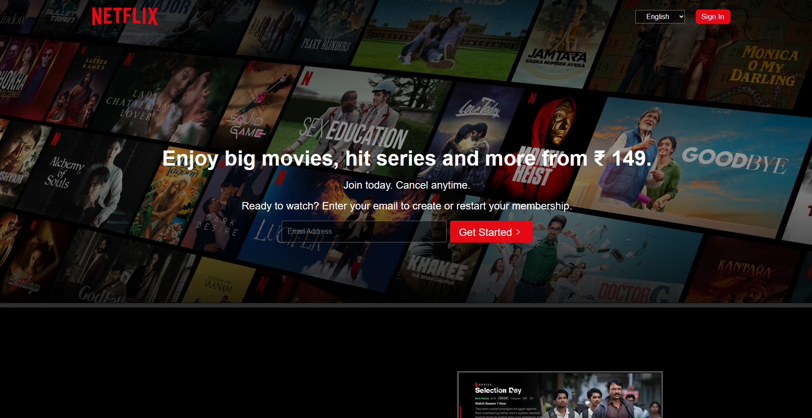
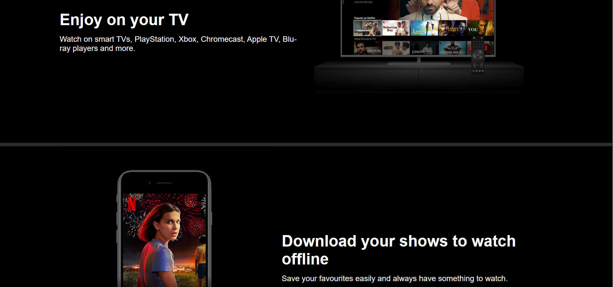
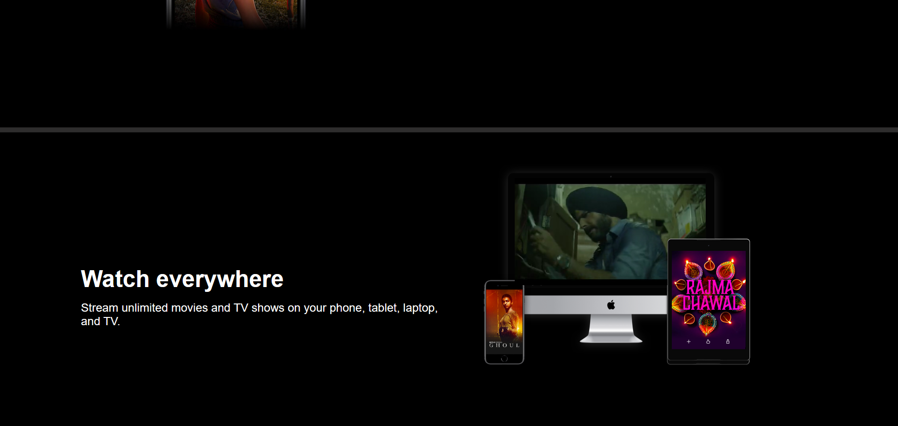
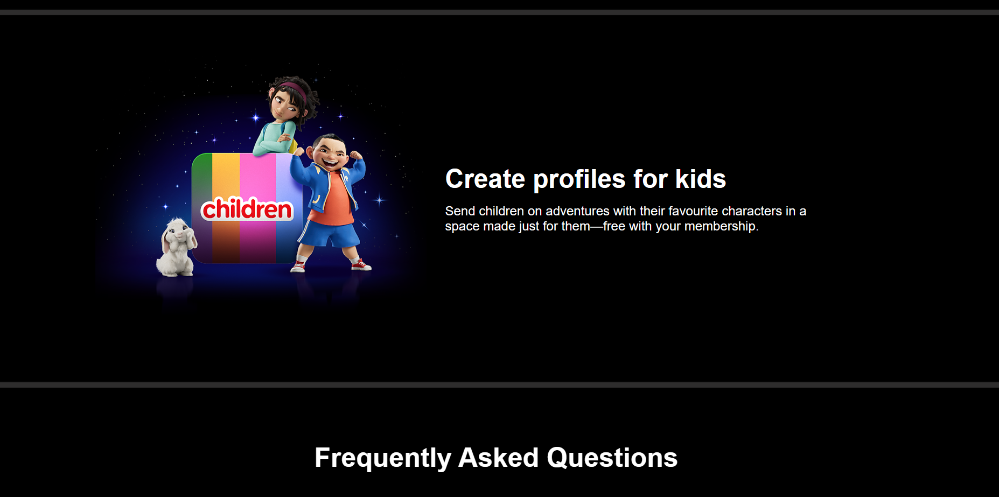
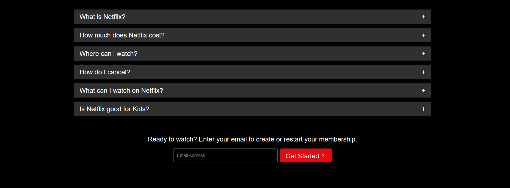
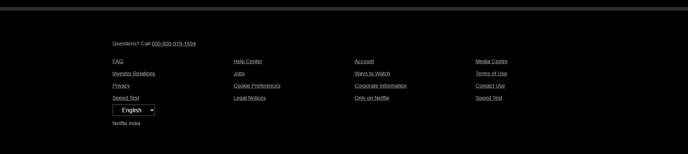

# Netflix Clone Project

This is a Netflix clone project that I developed as part of my internship with Bharat Interns. It is a static web page created using HTML and CSS to replicate the Netflix user interface.

## Features

- Replicates the Netflix user interface.
- Displays a list of movies and TV shows.
- Responsive design for various screen sizes.
- Utilizes CSS for styling and layout.

## Technologies Used

- HTML5
- CSS3

## Project Overview

The Netflix Clone project aims to recreate the popular streaming platform's interface using HTML and CSS. As part of my internship with Bharat Interns, this project challenged me to develop my front-end web development skills and gain a deeper understanding of responsive design techniques.

## Project Structure

The project is structured into a few main components:

- **HTML Files**: The HTML files are responsible for structuring the content of the web page. They define the layout and organization of elements such as headers, footers, and movie listings.

- **CSS Stylesheets**: CSS files contain the styles and design rules that give the project its visual appeal. I've used CSS to replicate the Netflix color scheme, fonts, and layout, ensuring that the user experience closely resembles the real Netflix site.

## Responsiveness

One of the primary goals of this project was to create a responsive design. The Netflix clone is optimized to work on various screen sizes, from desktop monitors to mobile devices. I used CSS media queries and flexible layout techniques to ensure that the site adapts seamlessly to different screen resolutions.

## Demo and Screenshot

Be sure to check out the live demo of the Netflix Clone project by following [this link](#your-demo-url). The screenshot above provides a glimpse of the project's appearance.

## Future Improvements

While this version of the project is static and built only with HTML and CSS, there are opportunities for further development. You may consider adding JavaScript for interactivity, integrating a backend for dynamic content, and implementing user authentication for a more complete Netflix-like experience.

I encourage contributions from the open-source community to enhance and expand the project's capabilities.

## Acknowledgments

I would like to express my gratitude to Bharat Interns for providing me with the opportunity to work on this project and learn valuable skills in web development. I also want to thank the online community for their tutorials and resources, which greatly assisted me in completing this project.

Please feel free to use, modify, or contribute to this project as needed. Your feedback and contributions are highly appreciated!

